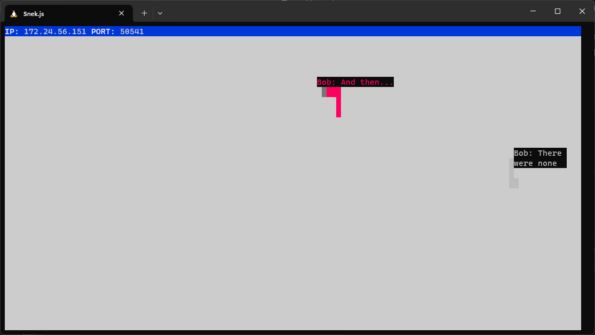
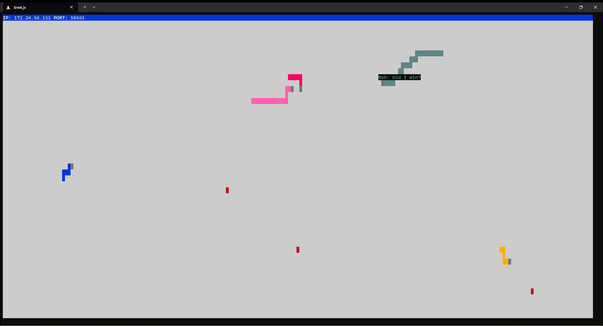

# Snake Client Project

Snake game is a very popular retro video game. It is a video game concept where the player maneuvers a dot(Snake) and grows it by ‘eating’ pieces of food. As it moves and eats, it grows and the growing snake becomes an obstacle to smooth maneuvers. The goal is to grow it to become as big as possible without bumping into the side walls, or bumping into itself, upon which it dies.

This is simply a multiplayer take on the genre. This game only be run locally.

Before you can run this client, you will need to be running the server side which you can download and install from [here](https://github.com/taniarascia/snek). 

## Final Product

 Two players playing against each other, and sharing taunts.
 Five players duking it out to see who will be the largest.

## Getting Started

- Follow steps inside the snek server repo to run the server side
- Run the development snake client using the `node play.js` command.
- Customize your character's name and their taunts by changing the `custom.js` file.